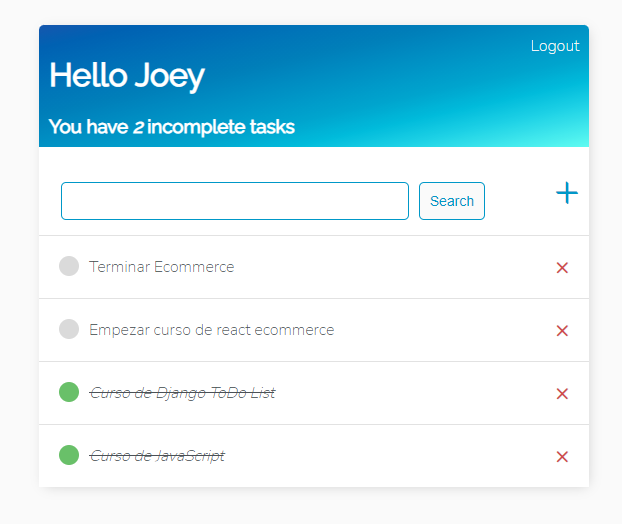
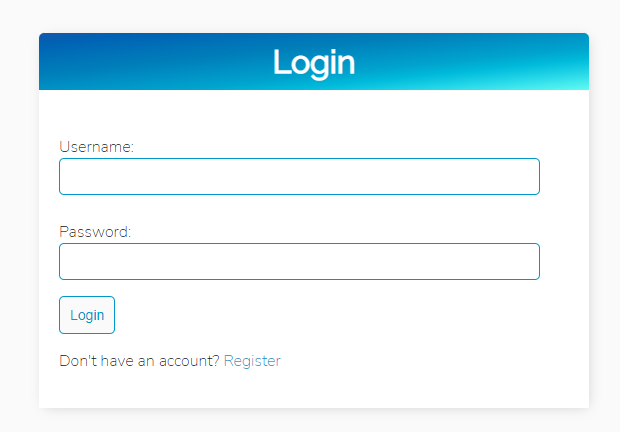
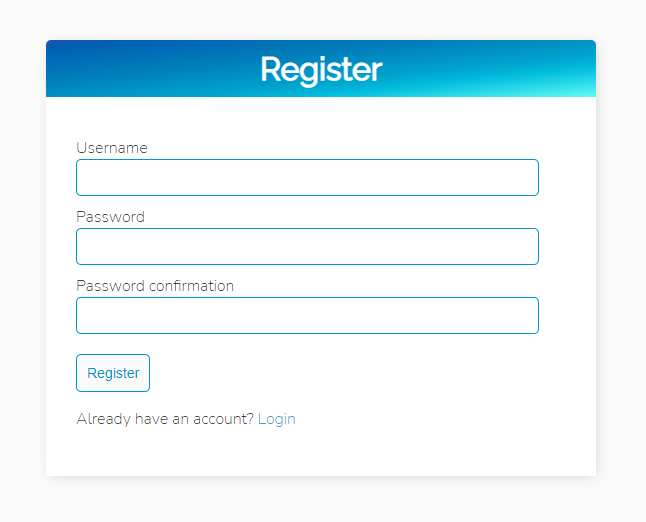

# Django To Do List

Project made in Django Framework - To Do List app

## Features
- Generic Class View
- Login
- Logout
- Register
- List, Create, Update and Delete items
- Mark as complete
- Search form

## demo

Link: [Project Demo](https://todo.designio.cc)

## Images

